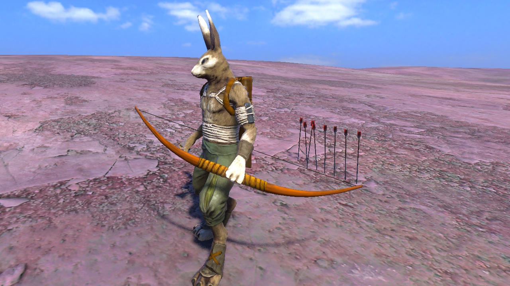

# Bow And Arrow  

## How to use :
Put the bow_and_arrow folder inside the ``[Installation Path]/Data/Mods`` folder.

	1. Open up the spawner menu and click on the Interactive Objects tab.
	2. At the bottom of the page you see the arrows, bow and quiver.
	3. Spawn the items in the scene and attach the bow and quiver to the character.
	3. Make sure the bow is in the left hand and an arrow in the right (Swap with B).
	4. Press Q to shoot at an enemy.

If, for some reason, you don't see the icons in the spawner menu, you should check the Mods page in the main menu. It will show you colliding mods. Remove the mod from the Mods folder that is colliding with and restart the game.

[Buy the game here.](http://www.wolfire.com/overgrowth)
