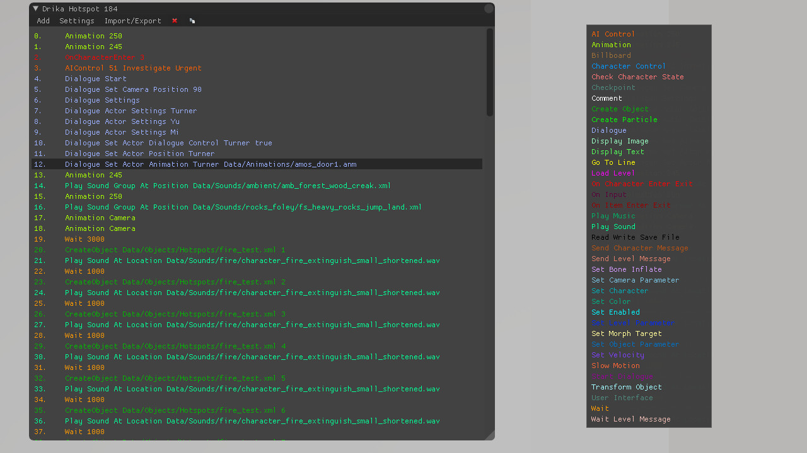
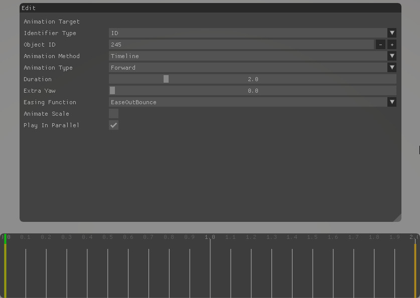
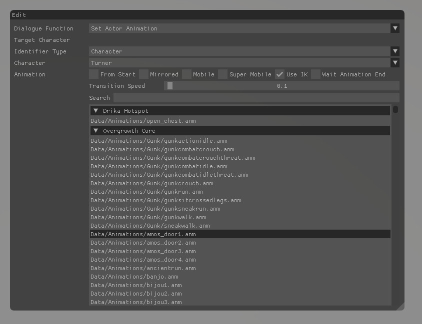
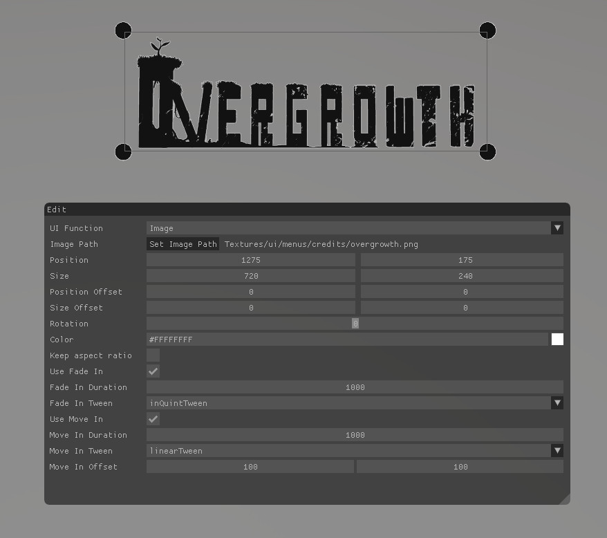

# Drika Hotspot (DHS)
Drika Hotspot or DHS for short is a tool that allows users to create scripts with a GUI. Every DHS executes it's functions from top to bottom making it easy to trigger events based on one or more conditions. For example opening a door when a character steps in front of it.  

The main DHS window with all the functions available.

## Some of the features:

- Dialogue system
- Creating and deleting objects
- Creating particles
- Controlling AI behaviour
- Displaying text and images
- Enabling slowmotion
- Play sounds and music

## Screenshots

The animation system that allows objects to be moved with a timeline. Similar to Blender's animation workflow.

The UI for setting a character's animation during dialogue.

Editing an image to be shown on screen during gameplay. It can be resized, moved coloured and much more.

[Buy the game here.](http://www.wolfire.com/overgrowth)
