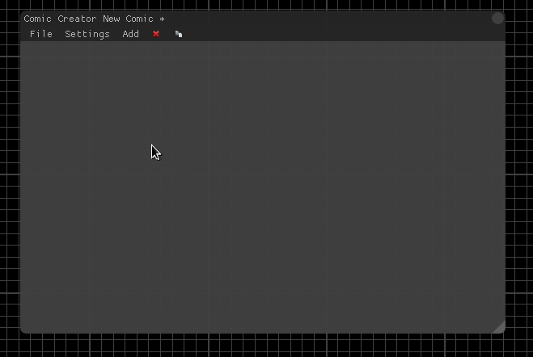
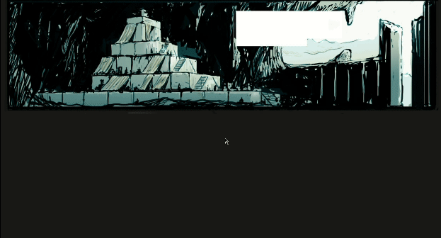

# Comic Creator

The Comic Creator lets you create dynamic comics inside Overgrowth. These comics can be saved, loaded and played back in the Comic Reader as well as in-game. This could also be used to create cutscenes which are better told using images.

## Basics
To create a new comic simply go to ``Play -> Comic Creator``. An empty sheet will be created for you with a grid. The list of available functions are under the menu button ``Add``. The Comic Creator will execute these function in order, starting at the top. Once enough functions are added you can change the order by drag and dropping the correct function at the correct line. You can preview a function by clicking on them once, or by using ``Arrow Up`` and ``Arrow Down`` to navigate the comic. Most of the functions have settings available. To edit these settings, double click the function you want to edit. If you would like to preview the comic press ``F1`` to toggle the editor on and off. To remove a function, select the target function and click the red cross icon in the menu bar or press the ``Delete`` key. Next to the delete icon is the duplicate button. This will copy the currently selected function and all of it's settings. To save the comic either go to ``File -> Save to file`` or press ``Ctrl + S``.



## Functions

### Crawl In
The Crawl In function is only used on text. Once this function is executed it will find the previous Text function and slowly reveal the text one character at a time. This can be interrupted by the user by pressing either mouse button to either skip or reset the Crawl In. There are two settings in the ``Settings`` tab that have an effect on this function. ``Text Sounds`` plays a sound effect when text is being added similar to the dialogue system in Overgrowth. ``Text Sound Variant`` is an option to change the sound effect to a selected few. This function also has a ``Duration`` setting which is how long the Crawl In should take in milliseconds.

### Fade In
To reveal a piece of text or an image the Fade In function can be used. This function will retrieve the previous ``Text`` or ``Image`` function and apply a Fade In. In the settings the duration can be set of the fade in milliseconds. The Tween Type is an option that modifies the fade to appear different.

### Font
When a Font function is added, all the text after it will be effected by this function until another Font function is found. This has a few options that can change your Comic drastically. The first option is to pick a font. Note that only ``.ttf`` files are supported by Overgrowth. The second option is to pick a font color. Either enter an HTML color code or click the colored square to use the color picker. The shadowed option either shows or hides the shadow at the back of each text. This will not work when the text is rotated however. The last option is the text size. There is a limit of 100, but by using ``Ctrl + LMB`` on the slider the value can be overridden.

### Image
Arguably the most important function in the Comic Creator. By default the Overgrowth logo will be shown and ready to be edited. To move the image click and drag somewhere on the image. The round icons at the corners of the image can be used to scale the image. Scaling the image can also be used to invert/mirror the image. Scaling and positioning the image are locked to the grid using the snap scale set under the ``Settings`` button. The function has a few options, changing the image file to begin with. The supported files are ``.png``, ``.jpg``, ``.tga`` and `.dds`. The sliders for position and scale can be used for more precise transformations. The offsets in both scale and position can be used to "cut out" a part of an image. This way images can be reused but show something different. The rotation setting can be used to rotate the image in degrees. The color option is used to tint the image. Note that it's adding color to the colors on the image. So tinting black has no effect for example. Keep aspect ration makes sure that the original size is held in account when it comes to scaling. This means the image can not be stretched incorrectly.

### Move In
The Move In has an effect on both images and text elements. It searched for the previous element and makes it move into the right position. The first option is the duration. This is how long the Move In takes in milliseconds. The second option is the offset. This is the added position from the origin. And lastly the Tween Type is used to make the Move In look a bit different.

### Music
This function can be used to add music to the comic. It uses the build-in music system that Overgrowth has. Just load a music XML file that follows the Overgrowth specifications and it's songs can be used by the ``Song`` function. An example of a music XML is ``Data/Music/lugaru.xml``.

### Page
Every comic should make use of pages. Once a page function is executed it hides all the elements on the previous page, giving you a clean slate. If however the user goes backwards in the comic and a page element is found, it will show the previous page elements. Every comic should start with a page element to correctly show and hide comic elements. This function does not have any settings.

### Song
After adding a ``Music`` function you can use this song function to play a specific piece of music. In the music XML each song has a name attached to it. In the settings you can put the name of the song you want to play, and once executed, Overgrowth will fade into this song smoothly.

### Sound
To play a specific sound file you can use this function. This can be useful for sound effects or something similar. To change the target sound file, open the settings and click ``Set Sound``. A file picker dialogue will open and you can choose either a ``.wav``, ``.ogg`` or ``.mp3``. Make sure the audio file is exported as mono, because stereo sounds are not supported.

### Text
The comic creator can show single or multiple lines of text. In the settings a text box is available to edit it's content. To move the text to a different position either click and drag the text, or use the position x and y settings. The text can also be rotated in degrees.

### Wait Click
For a more interactive comic you can add wait click functions. This will allow the comic to be paused until the player is ready to proceed by clicking ``LMB``. To go backwards in the comic the ``RMB`` can be clicked.

### Wait
If you want to the player to wait a certain amount of time a wait function can be added. The duration setting can be set in milliseconds.


## How to

### Add a comic to the comic reader
Once a comic has been created and saved to a text file it can be added to the comic reader which is available in the main menu. This is done by making a new mod that has a specific tag in it's ``mod.xml``.
[Read here how to make a new mod.](http://wiki.wolfire.com/index.php/Creating_a_new_Mod)

Add this line to your ``mod.xml`` between ``<Mod>`` and ``</Mod>``. Change the title, thumbnail and path to your comic. Once this has been done, and the mod is enabled it will show up in the list of available comic in ``Play -> Comic Reader``.
```xml
<MenuItem title="Example Comic" category="comic" thumbnail="Images/comic_reader_full.jpg">Data/Comics/example_in_menu.txt</MenuItem>
```

### Show a comic in a dialogue in-game.
When you want to show a specific comic during a dialogue only one line is needed in the dialogue script. Simply add this line and point it to your own comic text file.
```
send_level_message "show_comic Data/Comics/example_in_game.txt"
```

